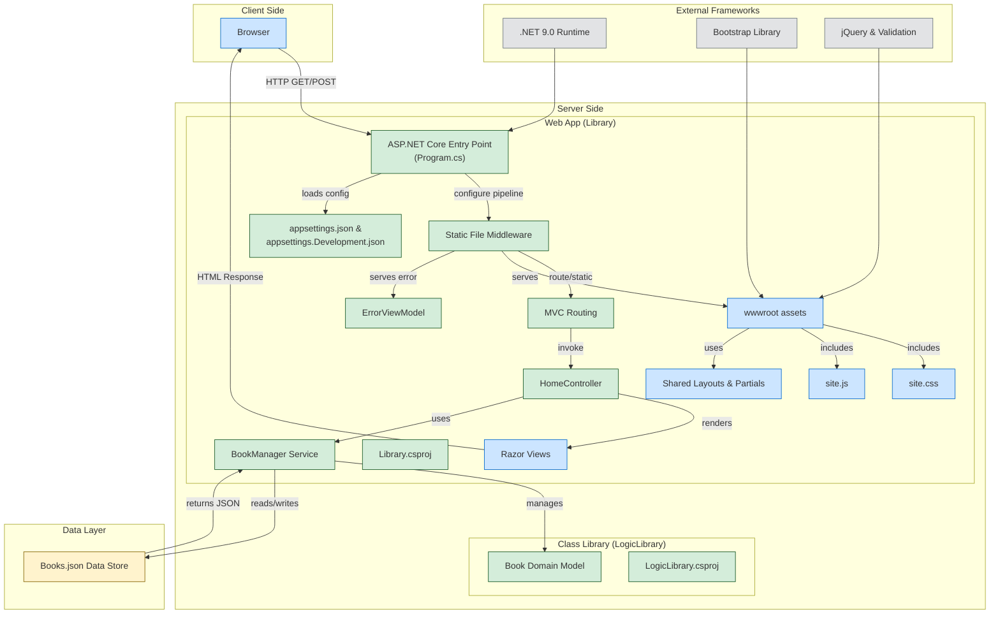

# Library CRUD

Este é um projeto simples de CRUD (Create, Read, Update, Delete) para gerenciamento de uma livraria, desenvolvido com ASP.NET Core MVC.

## Tecnologias Utilizadas

- ASP.NET Core MVC
- C#
- Entity Framework (opcional, dependendo da implementação do gerenciamento de dados)
- Bootstrap (para estilização da interface)

## Funcionalidades

- Listagem de livros cadastrados
- Adicionar um novo livro
- Editar informações de um livro
- Visualizar detalhes de um livro
- Remover um livro da lista

## Diagrama do Projeto

## Instalação e Execução

1. Clone o repositório:
   ```sh
   git clone https://github.com/GabrielVesal/library-crud.git
   ```

2. Navegue até a pasta do projeto:
   ```sh
   cd library-crud
   ```

3. Restaure as dependências:
   ```sh
   dotnet restore
   ```

4. Execute o projeto:
   ```sh
   dotnet run
   ```

5. Acesse a aplicação no navegador:
   ```
   http://localhost:5000
   ```

## Como Usar

- Para adicionar um livro, clique em **"Add new book"** e preencha os campos necessários.
- Para editar um livro, clique no botão **"Edit"** ao lado do livro desejado.
- Para visualizar detalhes de um livro, clique em **"View"**.
- Para remover um livro, clique em **"Remove"** e confirme a remoção.

## Modelo de Dados (Book)
```csharp
public class Book
{
    public string Id { get; set; } = Guid.NewGuid().ToString();
    public string Title { get; set; }
    public string Author { get; set; }
    public string Description { get; set; }
    public enum CategoryType { Technology, Business, Science, Arts, Health }
    public enum LanguageType { English, Spanish, French, German, Portuguese }
    public CategoryType Category { get; set; }
    public LanguageType Language { get; set; }
    public string Url { get; set; }
}
```

## Contribuição

Contribuições são bem-vindas! Para contribuir:
1. Fork o repositório
2. Crie uma nova branch (`git checkout -b minha-feature`)
3. Commit suas alterações (`git commit -m 'Adicionando uma nova funcionalidade'`)
4. Push para a branch (`git push origin minha-feature`)
5. Abra um Pull Request

## Licença

Este projeto está sob a licença MIT. Sinta-se à vontade para usar e modificar conforme necessário.

